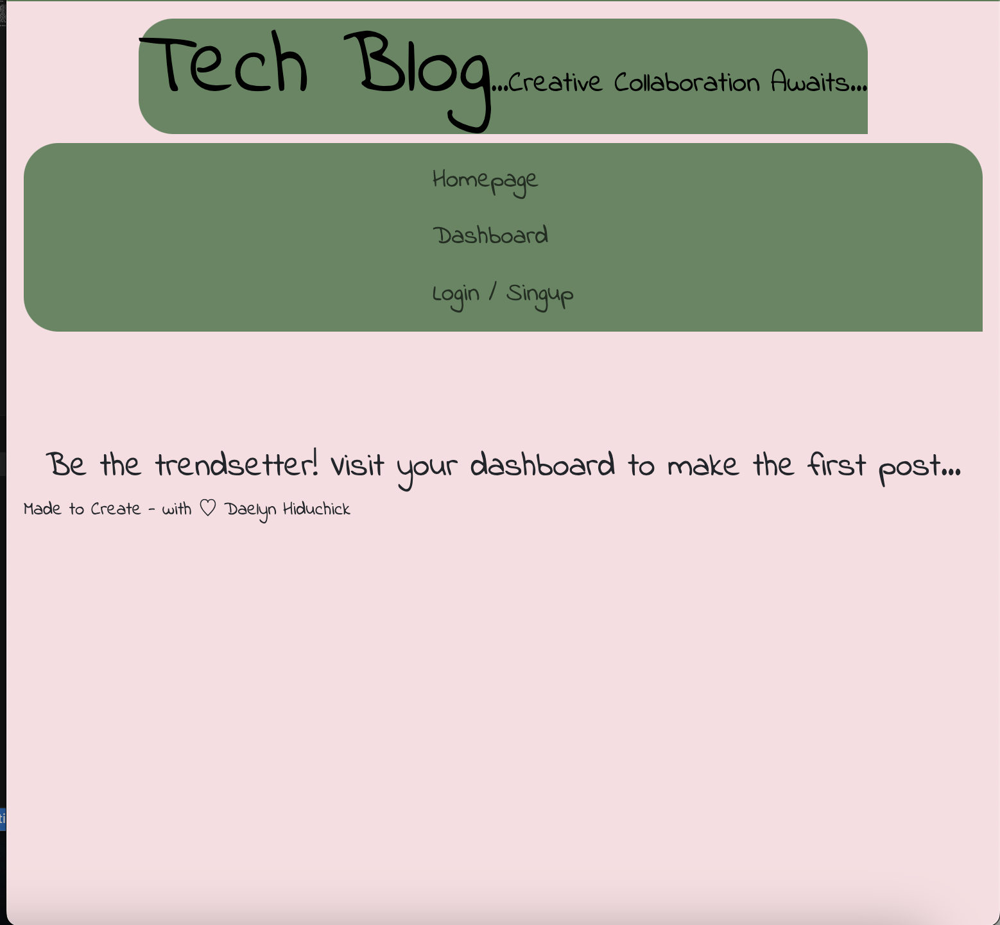
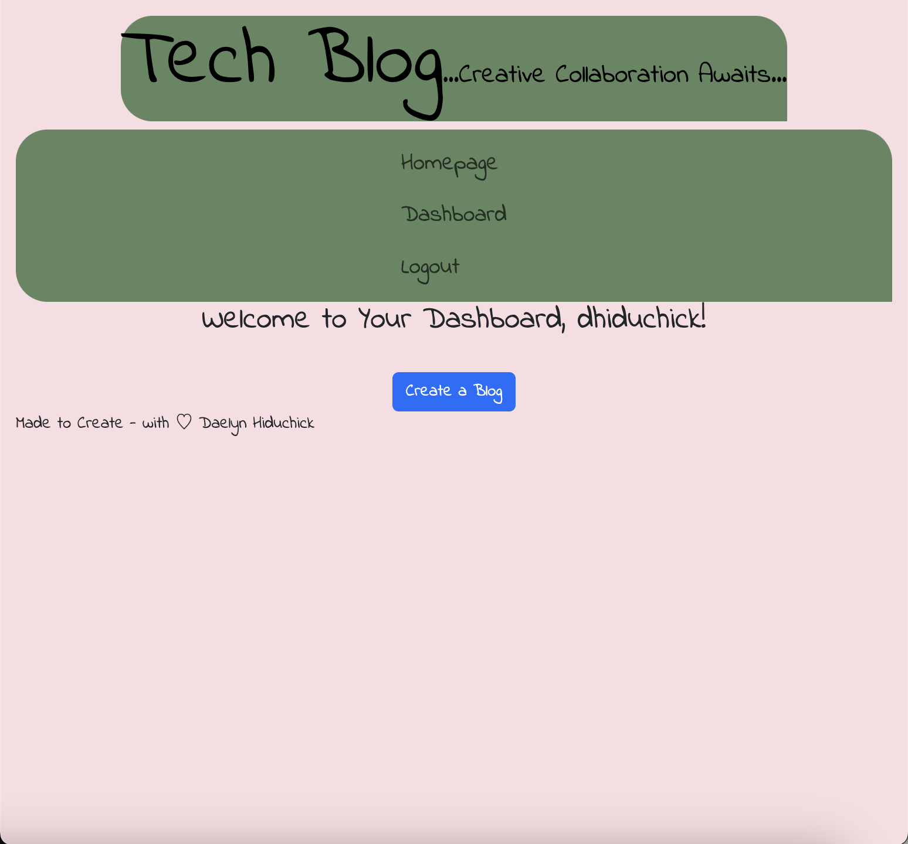
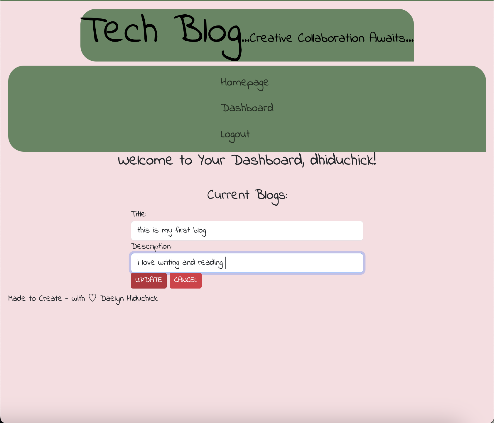

# Hiduchick-Tech-Blog

## Description
The goal of this innovative blog is to empower users to create and share impactful posts, with each user limited to one post at a time. This unique approach elevates the significance of each post, fostering meaningful engagement and discussions within the tech community.

## Architecture and Technologies
This project follows the MVC paradigm in its architectural structure. It utilizes Handlebars.js as the templating language, Sequelize as the ORM, and the express-session npm package for authentication.

## Deployment
The deployed application can be accessed here.

## Screenshots
Below are screenshots demonstrating the application's functionality:
Homepage

Login/Signup

Dashboard

Create a Post

Dashboard with Post

Post Options

Post Update

Leave Comment

Post With Comment

## Technologies Used
HTML (Handlebars.js)
JavaScript
CSS
Bootstrap
Node.js
dotenv
Express.js
Express-session
MySQL Database
Sequelize
bCrypt for password hashing

## Usage
Upon visiting the site, users are presented with the homepage displaying existing blog posts, if any, along with navigation links for the homepage and the dashboard, and an option to log in.
Clicking on the homepage link directs users to the homepage.
Clicking on other navigation links prompts users to sign up or sign in.
Signing up requires creating a username and password, which are then saved upon clicking the sign-up button, logging users into the site.
Upon subsequent visits, users can log in with their credentials.
Signed-in users see navigation links for the homepage, dashboard, and the option to sign out.
Clicking on the homepage link displays existing blog posts, and clicking on a post shows its details and allows leaving comments.
Adding a comment updates the post to display the comment and creator's information.
The dashboard displays posts created by the user, with options to add, edit, or delete posts.
Logging out signs the user out of the site.
Users are redirected to the login page if idle for a set time.

## Credits
Made with ˖⁺‧₊˚♡˚₊‧⁺˖ by Daelyn Hiduchick